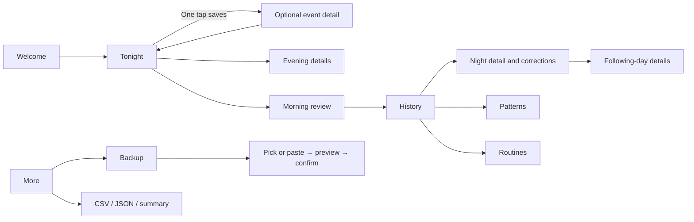

# PeeLog — basic UX handoff

13 September 2026 · Design package v1 · Quiet company

The user approved the first visual demo and asked for basic UX for all features
and the needed assets, with implementation kept separate. This package contains
screen studies, interaction specifications, copy, and design assets. The atlas
only navigates between examples; it does not implement logging, calculations,
storage, exports, or recovery.

- [Browse the screen atlas](ux/index.html)
- [Visual direction](VISUAL-DIRECTION.md)
- [Asset inventory and usage](ux/ASSETS.md)
- [Feature coverage](ux/COVERAGE.md)
- [Printable summary layout](ux/report.html)

## Decisions carried into this package

Quiet company combines dark blue surfaces, rounded controls, warm oatmeal
accents, restrained clay for wet observations, and static paper-textured art.
Use the same dark appearance across v1; a daytime theme is deferred. This is a
scope decision for the design handoff, not evidence of a separately approved
light-theme choice. Keep the name PeeLog and existing child-specific language.

Tonight / History / More are the three persistent destinations. Tonight handles
the current night and its preparation/review. History contains Nights, Patterns,
and Routines. More contains backup, restore, exports, appearance, installation,
and privacy/help. These nested destinations are not extra bottom tabs.

Use illustrations on welcome, Tonight, empty history, and the backup introduction.
No art on charts, forms, error messages, or the printable report. The illustration
toggle removes decoration without changing control positions.

## Interaction rules

The core paths are deliberately short:

1. A night-event tap commits the event immediately. Show Saved only after the
   write succeeds. A chip changes an already saved event; no confirmation form.
2. Keep the five night actions in stable positions. Optional detail opens below
   the saved strip; it can scroll, but cannot move the action grid above it.
   At short heights reduce decorative space before reducing controls.
3. Details remain until Done, another event, or navigation. No auto-dismiss timer.
   Done only closes detail; it does not save the event a second time.
4. Undo removes only the latest event and its details. Next undo can remove the
   previous event. A correction elsewhere has its own Saved feedback.
5. Discrete evening/morning/day choices save when selected. Text and time edits
   commit on an explicit field Done or leaving the field with valid content.
   Invalid values stay visible and do not overwrite the previous valid value.
6. All fields except an explicit morning outcome can be skipped. Unknown is
   different from No or zero. Suggested times are placeholders until accepted;
   a displayed suggestion is not a recorded fact.
7. Navigating back keeps committed fields. Discard confirmation applies only to
   an unsaved edit draft, routine draft, or restore operation.
8. The app opens Tonight even when the last visit was elsewhere. No permissions,
   onboarding tour, or backup nudge blocks the first logging action.
9. No sounds or celebratory motion. Use visible confirmation; optional haptics
   supplement it only where supported. Respect reduced motion.
10. Production controls need at least 44 × 44 px hit areas, a visible focus state,
    readable labels, and no hover-only actions. Grow/scroll for large text; do not
    truncate an event name, date, error, or Undo label.

## Night identity and time

Every screen names the evening date: “Night of Sun, 13 September”. A compact
Tonight heading may show the shorter date; event editing also shows the calendar
date so “Mon, 14 Sep · 02:12” is unambiguous. Use the device locale for display.

The established 15:00–14:59 fallback determines a new night when none is open.
An existing active night remains explicit. If it is older than the current night,
show a compact “Sunday still needs a review” link while enabling logging into
the new night without forcing the review first. This is a UX clarification to the
original boundary rule: a stale open night must not collect another evening's data.

Changing an event date across the night boundary displays its destination night
before Save. Use the stored offset for existing timestamps; timezone or DST changes
must not silently reinterpret them. Do not infer asleep time from lights-out time.

## Screen and flow specifications

The screen identifiers below match the atlas and coverage table.

### W01–W02 · Welcome and installation

Welcome: notebook art, “A little context, one night at a time”, short local-data
explanation, primary Start logging, secondary Install on this phone, and Restore
a backup. Start logging goes directly to Tonight; there is no child-profile form.

Installation: show the platform-appropriate route, then Open installed app and
Check offline access instructions. The atlas depicts the iPhone flow from the
existing project scope. Platform wording and support must be verified during
implementation. No fabricated install button when the browser cannot offer one.

Check screen rows: Installed / browser tab, offline shell readiness, storage
availability, persistent-storage status, and version/update status. Use human
labels and expandable technical detail, with Recheck and Check for update.
Do not claim guaranteed retention or offline readiness without a real check.

### T01–T03 · Tonight, saved event, unresolved night

Tonight shows the evening date, optional asleep time, event count, the five large
actions, the latest saved event and Undo, and compact Evening details / Morning
review links. A missing asleep time reads “Sleep time not added”. No inferred dry
outcome when the event list is empty.

A new user's blank Tonight uses exactly the same grid. The status is “Nothing
logged yet”. On a saved event, show its type and time and expose optional detail.
The illustration never becomes a logging button.

An old incomplete night has its own Review link. The current-night date remains
prominent. If the morning was already completed, another event in that same night
reopens review; make this visible instead of silently preserving an incompatible
outcome. When there are wet events, Dry night requires the conflict flow in S01.

### E01–E05 · Every event detail

All five share a saved-event header, editable timestamp link, optional fields,
Done, and Undo. An unknown choice starts unselected; tapping the selected chip
clears it. Multi-select applies only where stated.

| Screen | Event | Optional fields and wording |
| --- | --- | --- |
| E01 | Wet bed | Amount: Damp / Wet / Soaked. Who noticed: She woke / I found it. Changed: Sheets / Pyjamas (multi-select). |
| E02 | She asked to pee | Amount: None / Some / Lots. Made it to the toilet: Yes / No. |
| E03 | I lifted her | Amount: None / Some / Lots. Woke during the lift: Yes / No. |
| E04 | Water | Amount: A sip / A cup. |
| E05 | Woke up | Optional short note; prompt “Anything you want to remember?” |

Wet bed and a failed self-toilet attempt are separate recorded facts; do not
automatically manufacture a wet-bed event from “Did not make it”. Offer a clear
Log wet bed action if appropriate. Detail text must not imply this is a diagnosis.

### R01 · Evening details

Reached from Tonight and from any night record. Header names the evening date.
Groups: what she wore; dinner and drinks; last toilet; sleep; day context; note.

| Field | Control / initial state |
| --- | --- |
| What she wore | None / Pull-up / Diaper, initially unknown |
| Dinner | Time, optional |
| Evening drinks | Repeatable rows: time + Sip / Cup / Lots; Add drink and row Remove |
| Last toilet | Time + None / Some / Lots output |
| Lights out | Time, optional |
| Fell asleep | Time + Estimated checkbox; separate from lights out |
| Day context | Nap / Excited / Unwell / Away / New place / Late nap; multi-select |
| Note | Optional multiline plain text |
| Active routine | Current routine name, dates, and View routine link; no automatic advice |

New evenings may offer Use last evening's times, labelled Suggested, with an
explicit acceptance tap. Do not copy drinks, symptoms, or outcomes. Starting a
night does not require any of these fields.

### R02 · Morning review

Lead with equal-weight Dry night / Wet night. One tap records only that outcome
and completes morning review; all other fields remain unknown. The parent may
continue adding wake time, full changes count, mood, sleep signs, and a note.

Controls: wake time; changes stepper (unset until entered, minimum zero); mood
Upset / OK / Happy; sleep signs Snoring / Mouth breathing / Restless / None.
None excludes other signs; unknown is the initial state. A wet event already
recorded appears above the choices as context without silently confirming Wet.

If Dry conflicts with a wet event, explain “This night includes a wet-bed entry”
with Review entries and Keep wet night. Choosing Dry cannot erase an event.
Correct or remove the mistaken wet entry first, then confirm the outcome.

When a backup is due, place its gentle nudge after review, never above the outcome.
An incomplete evening record does not block a morning outcome.

### R03 · Day after the night

Reached at next evening preparation and from night detail. Label both dates:
“Monday daytime · following Sunday night”. This avoids putting symptoms into
the wrong night. Every field is optional.

Controls: toilet count; urgency Yes / No; holding Yes / No; daytime accidents
count; stool None / Hard / Normal / Loose; fluids Low / Normal / High. Counts
start unset, and Yes/No has no preselection. Explain holding in plain language:
“Crossing legs or squatting to hold pee”. No interpretation or treatment tips.

### H01–H04 · History, empty history, night detail, event editing

Nights is the default History subview. Rows contain date, explicit outcome state,
first wetting time when known, and important event labels. Use filters All /
Needs review, month navigation, and Add past night. Empty state uses notebook art,
Start tonight, and Add past night. Gaps read No record, never Dry.

Night detail groups Evening, Events, Morning, and Following day. Each has an Edit
or Add details action. Event rows open an edit draft with type, full date/time,
and that type's optional fields. Changing type clears incompatible detail only
after Save, with a brief notice before committing. Cancel keeps the original.

Delete event requires a named confirmation (“Delete Water at 23:40?”), then gives
an Undo recovery action. Deleting an entire night requires its own explicit
confirmation identifying the date and event count. Never use swipe as the only
way to reveal editing or deletion.

Backfill chooses the evening date first. If a record exists, Open existing night
replaces Create. Past-night event entries request a real calendar date and time;
they must not default silently to now. Recheck outcome if wet entries change.

### P01–P03 · Patterns and comparisons

History → Patterns. Period control: 7 days / 28 days, with an explicit date range.
Show coverage first: “24 of 28 nights reviewed · 4 incomplete”. A recent-week
view shows direct counts (for example 3 wet of 6 reviewed) rather than a trend
claim based on fewer than 10 nights. The 28-day view supports the full metrics.

Use one restrained chart or comparison per question. Label n, units, incomplete
records, and missing inputs. Provide equivalent text. Neutral clay represents
wetting; blue slate represents timing; selection and status always also use labels.
Do not make causal or diagnostic claims, and do not use “better/worse” arrows.

| Metric / UI name | Definition and missing-data behaviour |
| --- | --- |
| Wet nights | Confirmed wet / confirmed dry-or-wet nights in the selected period. Normalised wet nights/week = ratio × 7. An unreviewed night with a wet event says Wet recorded, review due and is excluded from this finalised rate. |
| First wetting after sleep | Time from known asleep timestamp to first wet event; exclude missing asleep or invalid ordering and state how many excluded. Plot hours, not clock time. |
| Wettings per wet night | Total wet events / wet nights with event detail. Wet outcomes without events are not zero wettings; exclude and disclose those nights. |
| Woke and noticed | Self-noticed wet events / wet events with known noticed field, over 28 days; show unknown count separately. |
| Asked to pee | Nights with ≥1 self-toilet event / reviewed nights; keep independent from dry outcome. |
| Evening drinks | Compare wet/eligible reviewed nights for recorded post-dinner drink groups. Unknown dinner/drinks excluded; no drinks means explicitly confirmed none, not empty data. |
| Last toilet before sleep | Compare wet/eligible reviewed nights in clearly labelled timing groups. Use only known, correctly ordered timestamps. |
| Lifts | Compare dry/eligible nights with a lift versus confirmed no lift; incomplete event records cannot establish no lift. |
| Bowel pattern | Compare wet rate by the recorded daytime stool category preceding that night, with correct date association. No record is unknown, distinct from recorded None. |

These denominator rules are deliberate UX corrections to ambiguities in the
original scope. Implementation needs an explicit way to confirm no evening drinks
and event completeness before including those nights in comparison groups. Add
“No evening drinks” to R01 and “Night events complete” to R02; both default unset.
The existing JSON schema will need to represent those facts separately from an
empty array. This package specifies the behaviour, not that data-model change.

Below 10 eligible records, show actual counts and “Not enough recorded nights
for a comparison yet”; suppress percentage trends. For two-group comparisons,
require at least 10 eligible nights in each group to interpret the comparison.
Event-based noticing uses 10 known-noticed events. Never make the whole chart
low contrast to indicate insufficiency. The explicit 7-day count exception avoids
the original impossible requirement for 10 nights inside a 7-day window.

### X01–X03 · Routine changes (Experiments)

User-facing name: Routines. Show current and past changes, not a lab-style
experiment dashboard. Create form: name, start evening, optional note. No health
rule suggestions or treatment claims. Encourage one recorded change at a time.

One active routine at a time. Starting a new one while another is active offers
End current and start new, with the dates shown. Future starts are labelled
Scheduled. Starting today associates it with tonight; existing older nights are
not rewritten without explicit date editing.

Routine detail: name, date range, note, Edit, End routine, and an equal-length
Before / During comparison with both sample sizes. Missing days stay missing;
do not extend one window to collect more records. An ongoing routine uses elapsed
completed nights only. Label “Observed alongside this routine; not proof of cause”.
If either group has <10 eligible nights, show counts and the insufficient-data state.

### M01–M02 · More and appearance

More links Backup & restore, Export & summary, Appearance, Install & offline,
and Privacy & reminders. Show Last backup here, never in the nighttime action grid.
Appearance has a static-art toggle (on by default), a reduced-decoration preview,
and optional Keep screen awake with clear unsupported/unavailable feedback.
Follow system reduced-motion preferences. Dark appearance applies to all v1
screens; no automatic morning brightness switch.

Privacy/help explains one phone, local records, no account or analytics, exports
chosen by the parent, and device loss/browser data removal risk. Explain external
Reminders/alarms without suggesting that the app can schedule a reliable alarm.

### B01 · Backup

Show Last exported backup with timestamp, approximate nights included, and Create
backup. Overdue state: “It's been 11 days since your last backup” with Backup now
and Later. Sunday morning can show a quiet nudge after the outcome is logged.

Use the system save/share sheet when available, with download fallback. Cancellation
returns to the unchanged last-backup timestamp. Where successful export cannot be
verified, say “Backup prepared” and ask “Saved it somewhere safe?” before updating
the user-confirmed backup status. Do not call an opened share sheet a verified copy.

Failure: explain No backup created, keep records intact, offer Try again. The
design never initiates a real backup itself.

### B02–B03 · Restore, preview, duplicate dates

Pick a JSON backup or paste JSON. Before changing data, validate format/version
and preview date range, night count, routine count, and dates already on the phone.
Wrong type, invalid JSON, and newer unsupported versions have distinct messages;
none changes local records. Parsing errors do not dump raw private JSON on screen.

Default: Add missing nights, keeping existing dates untouched. Show the number
of added and skipped dates. Explicit alternative Replace this phone's log opens
a confirmation stating exactly how many local nights will be replaced. Offer
Back up current log before replacement; allow an explicit Skip backup decision.
No partial import on failure. Success shows what changed and links to History.

Conflicting same-date records are never silently merged. Future implementation
must keep routine references consistent when adding missing nights and present
routine conflicts in the preview. A damaged reference prevents applying the backup
until resolved. The atlas illustrates a simple duplicate-date case.

### O01–O02 · Export and printable summary

Export offers CSV (night rows), JSON (full backup), and Summary sheet. Clearly
distinguish sharing a selected range from making a complete backup. CSV and summary
use a selected date range; JSON contains the full log. Missing values stay blank.

Preview the one-page summary before print/save/share. Include date range, recorded
coverage, wet-night rate, first-wetting timing when known, self-toilet nights,
noticing observations, daytime symptoms, bowel pattern, sleep signs, current routine,
and optional parent note. Keep counts/denominators beside figures. Use neutral
phrasing, no diagnosis, treatment recommendation, child score, or automatic name.

The printable sheet is the sole light surface in this package. Open preview only
on explicit request, announce it as a print preview, and do not brighten Tonight
automatically. The specimen contains fictional data and is marked Sample.
Long notes must be constrained or moved to a clearly labelled second page in
implementation; do not shrink text to force unlimited content onto one page.

### S01–S03 · Shared edge states

| State | Visible response | Recovery |
| --- | --- | --- |
| Save failed / storage full | “Not saved” beside the attempted event; preserve its time and details in view | Retry; Export existing records; no success checkmark |
| Undo/delete save fails | Original record remains; explain removal did not save | Retry; do not claim it was removed |
| Offline and shell ready | Quiet availability in More; logging remains normal | No blocking network banner |
| No records / missing night | No record or No nights yet; never Dry | Start tonight / Add past night |
| Missing morning outcome | Review due, even when wet events exist | Review that night |
| Dry/wet contradiction | Name the conflicting event | Review entries; correct mistaken record before Dry |
| Invalid/future event time | Error beside time; keep entered value | Correct time/date; no silent coercion |
| Unsupported keep-awake / persistence | Unavailable or browser-managed | Continue logging; never promise durability |
| Import failure or cancelled share | Existing data and timestamps unchanged | Retry, choose another file, or return |
| Update available | Non-blocking note in More | Apply only after pending edits are committed |

## Visual and content handoff

Use the asset files in `docs/ux/assets/`, not the old production icons. The chosen
identity is a crescent resting over a blue cradle-like arc; the textured moon remains
the illustration, while the simpler vector mark survives small app-icon sizes.
App icon exports cover the sizes already required by the project and a 1024 px master.
Do not crop the mark itself; platform masks apply to the opaque square canvas.

Typography: Georgia/system serif for short page titles; platform sans-serif for
controls, body, and numbers. No downloaded font dependency. Use 16 px body/labels,
14 px secondary information, 12 px metadata minimum, and 36 px page titles as
handoff targets. The original small demo metadata is enlarged in this package.

Icons: 24 × 24 viewBox, 1.5 px rounded strokes, currentColor. Keep textual labels
on primary controls. Asset preview cards are presentation, not new app components.
Tone: “Wet bed”, “Saved”, “Review due”, “No record”. Avoid “success”, “failure”,
and congratulations for the child's outcomes; reserve errors for actual app failures.

## Ready for the separate implementation phase

This package covers all M0–M5 features in the original scope. It deliberately
clarifies missing-data semantics, safe restore, night identity, and neutral outcome
treatment. `DESIGN.md` remains the original product/technical baseline; this handoff
supersedes its visual and interaction proposals where the decisions above differ.
The implementation phase must reconcile the small schema additions described here.

The atlas is a basic UX reference, not a production-complete application or a
claim of real-device accessibility certification. Verify dark-room comfort, large
text, screen readers, native pickers, save/share behaviour, install wording, and
the final data calculations on the intended phone during implementation.
